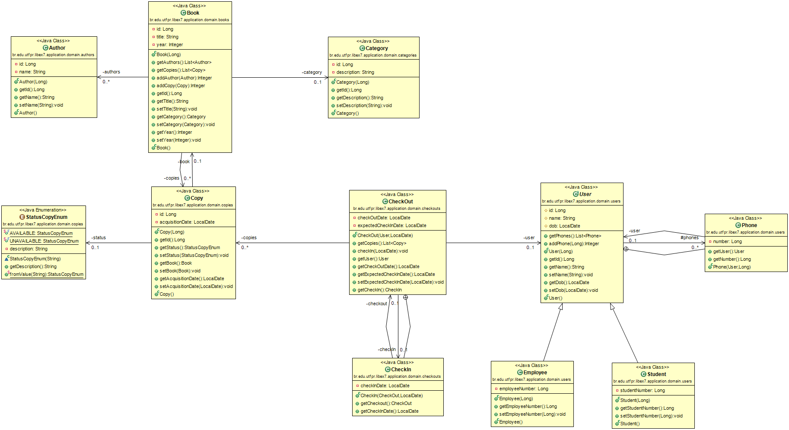
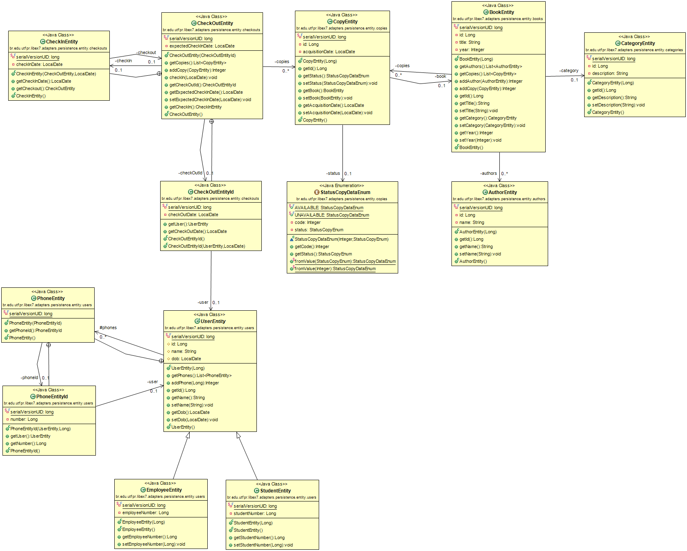
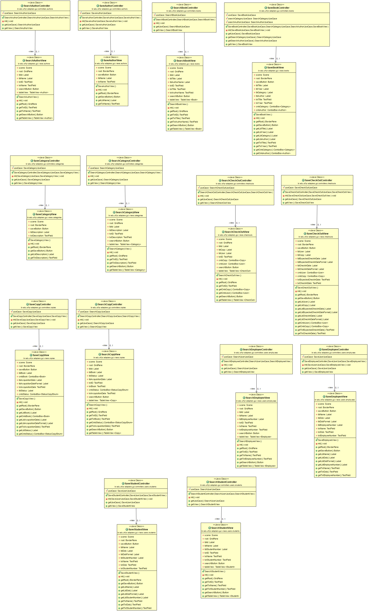

# Library Libex7

Projeto do Curso de Pós-Graduaçãp em Engenharia de Software da UTFPR.

## Building

Este projeto foi desenvolvido utilizando as seguintes tecnologias:

- JDK 8
- JavaFX
- Hibernate
- H2 Database
- Gradle

```
$ ./gradlew build
```


### Download Jar Exemplo

[libex7-1.0.0-SNAPSHOT.jar](assets/jar/libex7-1.0.0-SNAPSHOT.jar)

### Diagramas

#### Application Module:



#### Persistence Module:




#### GUI Module:



